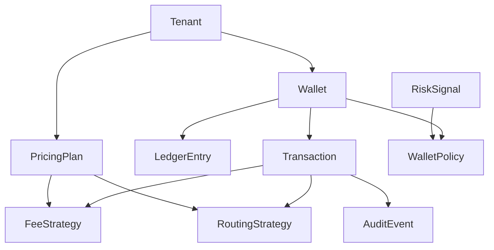

# Rolar Wallet SaaS - Stepwise Questions (No Answers)

## Diagram

## Stepwise Questions

Question 01: Implement `Currency` enum and `Money` value object.
Description: Create a safe money type that stores currency and amount in minor units.
Input: Currency code and integer amount in minor units.
Output: Immutable `Money` with add/subtract/compare methods.
Hint: Use an enum for currencies and forbid cross-currency math.

Question 02: Implement branded IDs and factories (`TenantId`, `WalletId`, `TransactionId`).
Description: Create nominal types for IDs to prevent mixing identifiers.
Input: Raw string values.
Output: Branded ID types with factory functions.
Hint: Use a `Brand<T, B>` helper type.

Question 03: Implement `DomainError` and `Result<T>` types.
Description: Provide a uniform way to return success or failure from domain rules.
Input: Success payload or error code/message.
Output: `Result<T>` discriminated union.
Hint: Use `ok: true | false` to drive narrowing.

Question 04: Implement `TenantPlan` type or enum.
Description: Represent plan tiers and their capabilities.
Input: Plan key, limits, and features.
Output: `TenantPlan` model with readonly fields.
Hint: Keep plan configuration separate from the tenant entity.

Question 05: Implement `PricingPlan` model.
Description: Store fee and routing rules that drive strategy selection.
Input: Plan id, fee rules, routing rules.
Output: `PricingPlan` instance with accessors.
Hint: Prefer readonly arrays for rules.

Question 06: Implement `Tenant` entity.
Description: Model tenant identity and plan assignment behavior.
Input: `TenantId`, name, slug, and `PricingPlan`.
Output: `Tenant` with `changePlan()` enforcing invariants.
Hint: Keep plan changes inside the entity method.

Question 07: Implement `WalletPolicy` value object.
Description: Encapsulate overdraft, currency, and limit rules.
Input: Policy flags and numeric limits.
Output: Immutable `WalletPolicy` with validation helpers.
Hint: Avoid storing policy in application services.

Question 08: Implement `Wallet` entity with balance invariant.
Description: Hold balance and apply policy when updating funds.
Input: `WalletId`, `TenantId`, currency, policy, initial `Money`.
Output: `Wallet` that rejects invalid balance changes.
Hint: Guard negative balance unless policy allows overdraft.

Question 09: Implement transaction state union and `Transaction` entity.
Description: Model transaction lifecycle with controlled transitions.
Input: `TransactionId`, type, amount, status, idempotency key.
Output: `Transaction` with `transitionTo()` rules.
Hint: Use discriminated unions for statuses.

Question 10: Implement `LedgerEntry` value object and a ledger builder.
Description: Create immutable ledger records from a transaction.
Input: `TransactionId`, `Money`, direction, timestamp.
Output: One or more `LedgerEntry` instances.
Hint: Ledger entries are append-only.

Question 11: Define `FeeStrategy` interface.
Description: Contract for fee calculation based on plan and transaction data.
Input: `Money`, `TenantPlan`, transaction type.
Output: `Money` fee.
Hint: Keep the interface in the wallet or pricing module.

Question 12: Implement `FlatFeeStrategy`.
Description: Charge a constant fee per transaction.
Input: `Money`, flat fee config.
Output: `Money` fee with the same currency.
Hint: Reject fee calc if currencies do not match.

Question 13: Implement `TieredFeeStrategy`.
Description: Charge a fee based on amount tiers.
Input: `Money`, tier rules.
Output: `Money` fee based on matched tier.
Hint: Sort tiers and pick the first match.

Question 14: Define `RoutingStrategy` interface.
Description: Contract for payout routing decisions.
Input: Payout request, `TenantPlan`.
Output: `RoutingDecision` with provider and SLA.
Hint: Keep routing deterministic.

Question 15: Implement `BankRoutingStrategy`.
Description: Select a bank rail provider based on plan rules.
Input: Payout request, `TenantPlan`.
Output: `RoutingDecision` for bank rails.
Hint: Encode provider choice in configuration.

Question 16: Implement `CardRoutingStrategy`.
Description: Select a card payout provider.
Input: Payout request, `TenantPlan`.
Output: `RoutingDecision` for card rails.
Hint: Validate region and card type before routing.

Question 17: Implement `StrategyResolver`.
Description: Resolve fee and routing strategies by plan.
Input: `PricingPlan` and strategy type.
Output: Strategy instance (fee or routing).
Hint: Use a registry map instead of switch statements.

Question 18: Implement `RiskSignal` value object.
Description: Represent incoming risk data for decisions.
Input: Risk score, flags, and source.
Output: Immutable `RiskSignal`.
Hint: Keep fields readonly and validated.

Question 19: Implement `LimitStrategy` interface and one implementation.
Description: Decide whether an action is allowed based on risk.
Input: `Wallet`, `RiskSignal`.
Output: `LimitDecision` with allow/deny and reason.
Hint: Return a reason code for audits.

Question 20: Define repository interfaces.
Description: Create ports for `Tenant`, `Wallet`, and `Ledger` persistence.
Input: IDs and query criteria.
Output: Interfaces with `findById`, `save`, and list methods.
Hint: No database code, only interfaces.

Question 21: Implement `CreateTenant` use case.
Description: Create a tenant and assign a pricing plan.
Input: Tenant name, slug, plan id.
Output: Created `Tenant` and audit event.
Hint: Use repositories and return `Result<T>`.

Question 22: Implement `OpenWallet` use case.
Description: Open a new wallet for a tenant.
Input: Tenant id, currency, initial amount.
Output: New `Wallet` with initial ledger entries.
Hint: Validate policy and currency.

Question 23: Implement `PostTransaction` use case with idempotency.
Description: Post a transaction and produce ledger entries once.
Input: Wallet id, idempotency key, transaction request.
Output: `Transaction` and ledger entries.
Hint: Check for existing idempotency key before posting.

Question 24: Implement `TransferFunds` use case.
Description: Transfer between wallets in the same tenant.
Input: Source wallet id, target wallet id, amount.
Output: Transfer transaction and ledger entries.
Hint: Ensure atomic behavior at the application layer.

Question 25: Implement `Payout` use case.
Description: Payout funds using routing strategy.
Input: Wallet id, payout request.
Output: Routing decision and ledger entries.
Hint: Resolve the routing strategy from the plan.

Question 26: Implement `AuditEvent` and `RecordAuditEvent` use case.
Description: Capture domain actions for compliance.
Input: Actor id, action, metadata.
Output: Persisted `AuditEvent`.
Hint: Keep audit data immutable.

Question 27: Implement DTOs and type guards for API input.
Description: Validate incoming requests before they reach domain code.
Input: Raw payload (`unknown`).
Output: Typed DTO or `DomainError`.
Hint: Use type guards and avoid `any`.

Question 28: Write unit tests for fee strategies.
Description: Verify deterministic fee outputs for edge cases.
Input: Sample amounts and plan configs.
Output: Assertions on `Money` results.
Hint: Cover currency mismatch and tier boundaries.

Question 29: Write unit tests for ledger invariants.
Description: Ensure wallet balance rules never break.
Input: Transactions that would overdraw.
Output: Assertions that invalid changes are rejected.
Hint: Test overdraft allowed vs denied.

Question 30: Write a module boundary note.
Description: Document allowed dependencies between modules and layers.
Input: List of modules and dependency rules.
Output: Short markdown note in the module root.
Hint: Keep it simple and enforce domain isolation.
