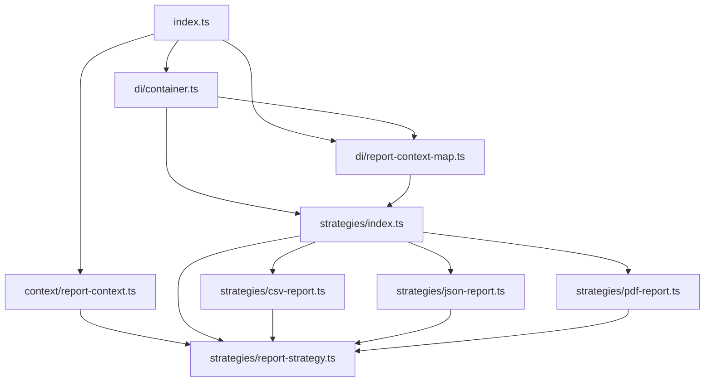

# Multi-Report System

This diagram shows how the files connect via imports and strategy usage.

## Use Cases 

- `index.ts` is the entry point of the application. It imports the `ReportContext`, `ReportContainer`, and `reportContextMap` to generate reports based on the file type.

- If new report types are added, they can be registered in the `ReportContainer` and added to the `reportContextMap` without modifying the existing code in `index.ts`, adhering to the Open/Closed Principle.